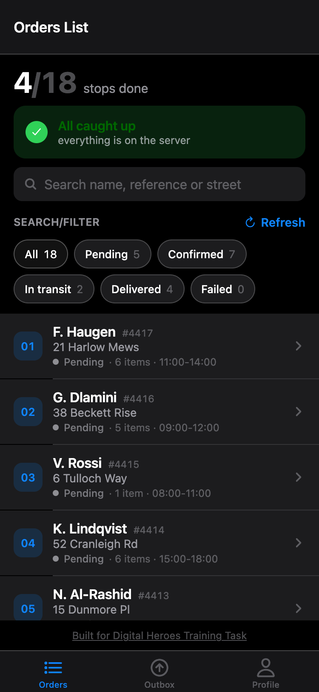
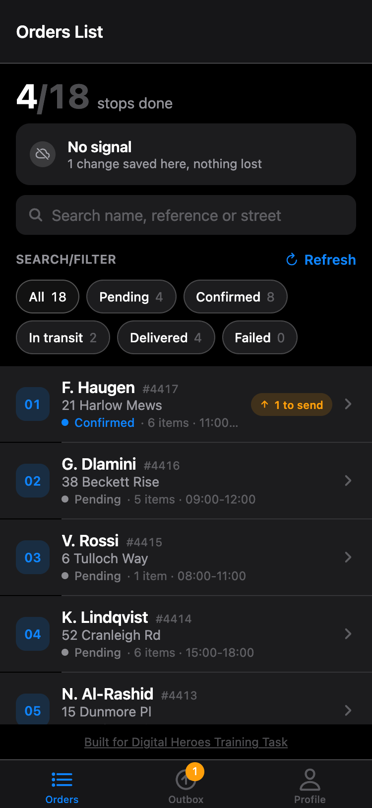
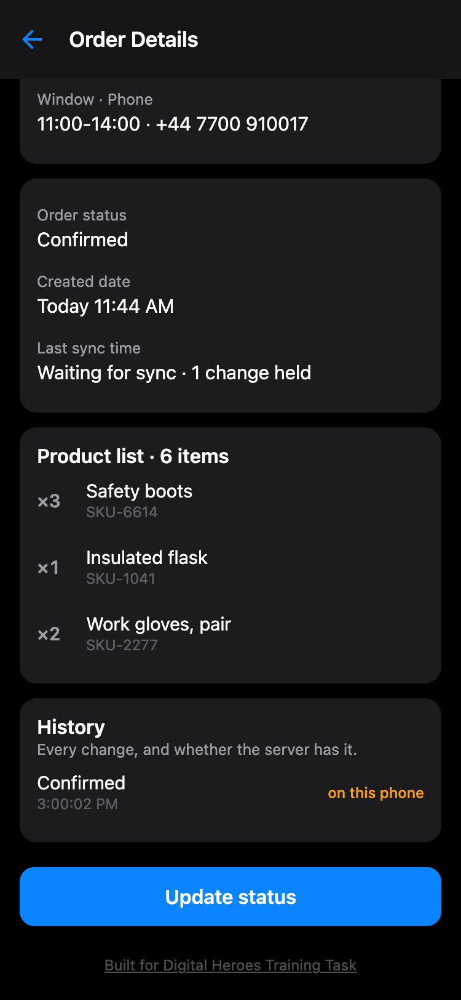
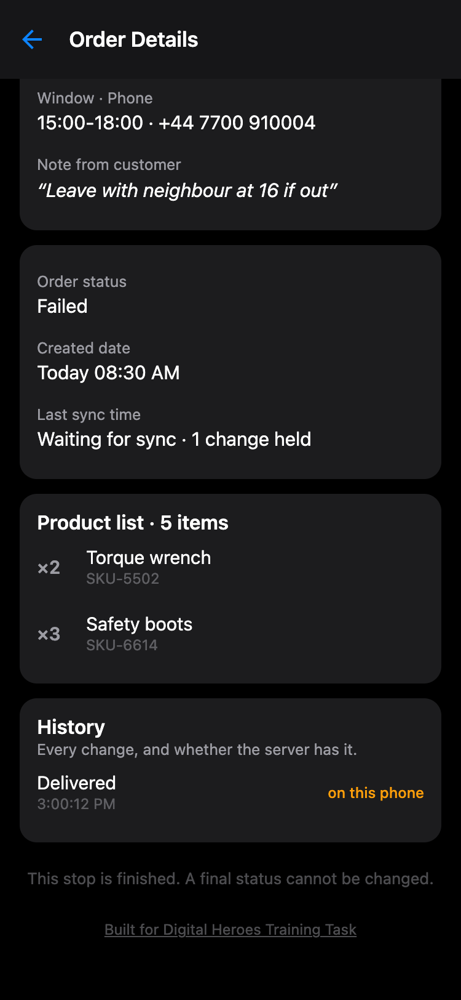
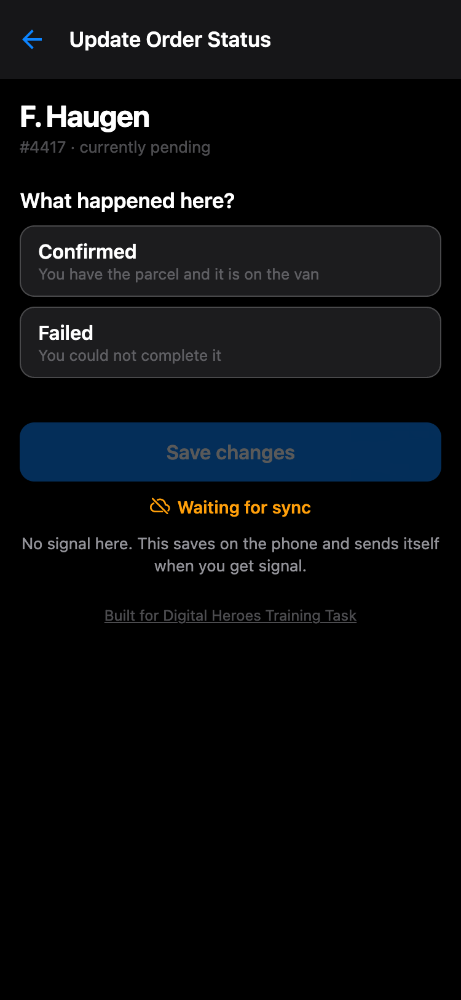
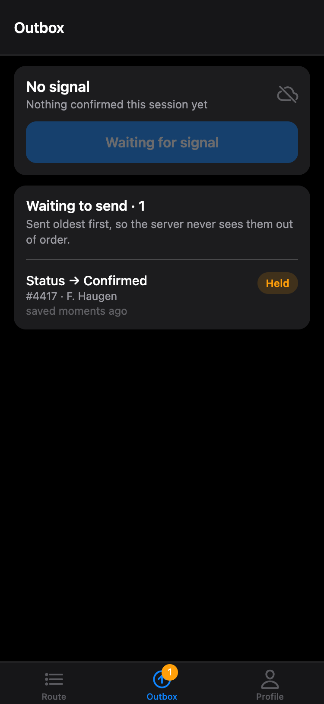
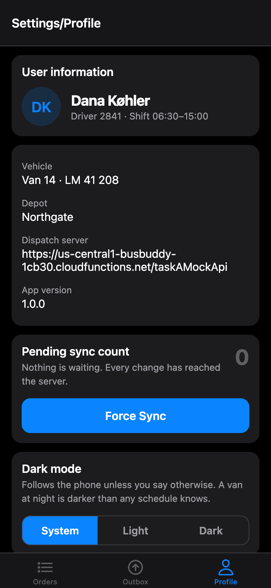
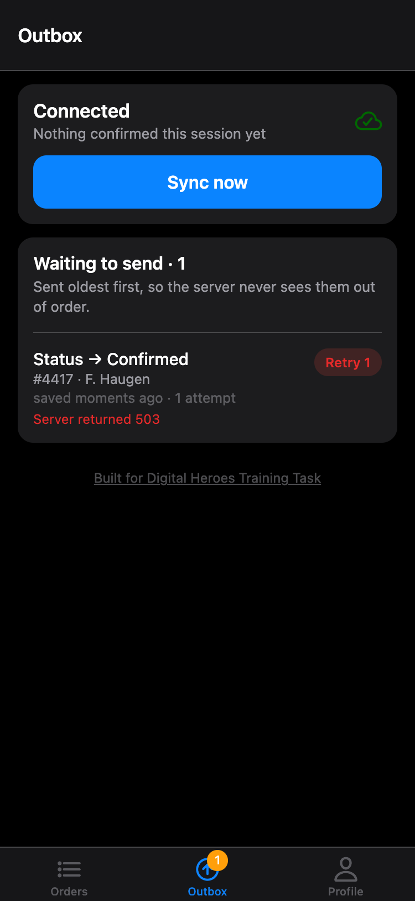
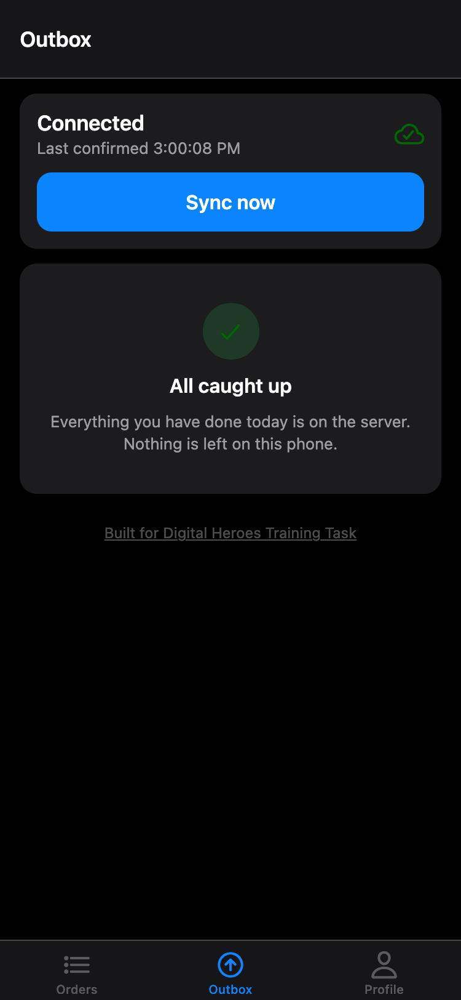

# Lastmile

An offline-first order management app for delivery drivers, built with React Native and Expo.

Submitted for the Digital Heroes Mobile App Developer task (Role 06, Task A).

| | |
| --- | --- |
| Live web build | https://adith-senthil-kumar.github.io/TaskA/ |
| Android APK | https://expo.dev/accounts/adith7301/projects/TaskA/builds/f486a449-1a44-41ac-8c24-079178c6fb8d |
| Repository | https://github.com/Adith-Senthil-kumar/TaskA |

---

## 1. Project Overview

### What the app does

Lastmile is the app a delivery driver holds while working a route. It shows the
stops assigned for the day, what is in each parcel, and who it is for; it lets
the driver record what happened at each door; and it keeps that record safe and
in order until dispatch has actually received it.

### Main features

- Today's route as a list, with search and status filtering
- Full detail per stop: customer, address, delivery window, items, and the
  complete history of every change made on this device
- A status update flow that enforces the real delivery sequence and captures a
  failure reason or proof of delivery where one is warranted
- An **Outbox** showing every change still on the phone, how long it has waited,
  how many attempts have failed and why
- Conflict resolution the driver is asked to arbitrate, never guessed at
- Settings: driver identity, pending sync count, a manual Force Sync, dark mode

### The offline-first approach

The brief asked for a four-screen order management app that works offline. I
picked delivery drivers as the user because it is the context where offline-first
stops being a feature and becomes the requirement. A driver loses signal in
basements, lifts, underground car parks and on rural routes — and the moment they
most need to record something is the moment they are standing at a door, which is
exactly where the signal is worst.

The consequence is a single rule that shapes the whole codebase: **a driver's
action is committed to the local database and acknowledged on screen before the
network is consulted at all.** The network is never on the path between the tap
and the app's response, so the app behaves identically with and without signal.

If the app could be unusable for ninety seconds while a request retries, none of
the design below would be justified. Because it cannot, all of it is.

---

## 2. Screens

Five screens exist; the brief asked for four. All four required screens are
present — the fifth is an addition, explained below.

### Orders List

Today's route with a progress count, a sync status card, free-text search over
customer name, reference and street, and status filters.

Synced rows carry **no badge at all** — the absence of the orange pill is the
"done" state. That is what keeps a list of eighteen stops readable at arm's
length, and it is only possible because sync state is derived per row rather than
hidden behind a settings screen.

| All caught up | Offline, with work queued |
| --- | --- |
|  |  |

### Order Details

Customer details, the product list, order status, created date, last sync time,
and the change history with whether each entry has reached the server. Conflicts
are resolved here rather than on a screen of their own, because the decision
needs the address, the items and the history next to it.

| Saved locally, not yet sent | A conflict the app refuses to settle |
| --- | --- |
|  |  |

### Update Order Status

Only legal transitions are offered. Choosing *Failed* asks for a reason;
choosing *Delivered* offers proof of delivery. Offline, the screen says so
plainly and promises the change will send itself.

| Offline — "Waiting for sync" | Outbox holding the change |
| --- | --- |
|  |  |

### Settings/Profile

Driver, vehicle, depot, dispatch server, app version, pending sync count, a
manual **Force Sync**, and a dark mode setting that overrides the device default
and is remembered.



### The fifth screen: Outbox

Sync is checked constantly mid-shift; settings are opened roughly once, on a
driver's first day. Putting them on the same screen buries the thing that
matters, so the queue got its own tab. It is the app's audit trail — if the app
is going to hold someone's work, it should be able to account for it.

| Server refused, backing off | Drained |
| --- | --- |
|  |  |

### The visual argument

The interface was designed before it was built, from a written brief that
specified only what each screen had to do — no colours, no layout, no navigation
pattern — so the visual argument would be made independently of the data model.

**Calm by default. Colour only when the phone still owes the server something.**

| Colour | Meaning |
| --- | --- |
| Grey | Offline. A fact, not an error, and never styled as one |
| Orange | The phone is holding work the server has not confirmed |
| Red | The server refused. The only state that may eventually need the driver to act |
| Purple | A conflict. Rare by design |
| Green | Used exactly twice: shift progress, and the all-caught-up moment |

There is one status card at the top of the route and no other permanent chrome.
That card is the single place the app makes a claim about what the server has,
and it is required to be honest: it says "No signal — 3 changes saved here,
nothing lost" rather than implying anything has been sent.

**Where I diverged from the prototype.** The prototype used translucent iOS bars;
those only read correctly on iOS, and a cross-platform app that looks right on one
platform and approximate on the other is worse than one that looks deliberate on
both, so the bars are opaque. The prototype's demo data also ranked `delivered`
above `failed`, which would let the app auto-resolve that pair. I kept the
engine's rule instead — see §7.

---

## 3. Architecture Rationale

This is the section I would most want to be asked about.

### The shape

```
src/core/     pure TypeScript — no React, no React Native, no SQLite
src/data/     the adapters: expo-sqlite, fetch, NetInfo
src/store/    Zustand — a projection of the database, not a second truth
src/ui/       design tokens, shared components, sync-state vocabulary
src/app/      composition root, the only file that knows every concrete type
app/          expo-router screens
mock-api/     Node standard library mock server
```

It is a ports-and-adapters (hexagonal) layering rather than feature-first. This
app has one feature — orders — and one genuinely hard problem, which is
synchronisation. Slicing by feature would have put the interesting logic inside
the same folder as the screens that render it, and the whole argument below
depends on those being separable.

### Why the core has no framework imports

Everything in `src/core` — the sync engine, the conflict rule, the status machine,
the backoff — depends only on the interfaces in `core/ports.ts`. Storage, HTTP and
connectivity are injected.

This is the decision I would defend hardest, because of what it buys:

- **The tests that matter run in plain Node.** No `jest-expo` preset, no native
  module mocks, no simulator. The full suite is 50 tests in about two seconds.
  Sync logic that is slow or awkward to test does not get tested, and untested
  sync logic is where offline apps lose people's work.
- **The failure paths are reachable.** Testing "the server accepted the third
  retry but the response was lost" against a real network is impractical. Against
  a programmable fake it is four lines.
- **Swapping an adapter is a one-file change.** Moving from SQLite to
  WatermelonDB, or from `fetch` to something else, does not touch the engine or
  its tests.

The cost is one extra indirection and about 120 lines of interface definitions.
For a layer whose bugs are silent data loss, that is cheap.

### Why UI, store, repository, API and database are separated

Each boundary earns its place by the failure it prevents:

| Boundary | What it buys |
| --- | --- |
| **UI ↔ store** | Screens read a projection and dispatch intents. No screen knows SQL, HTTP or retry policy, so a design change cannot break sync |
| **Store ↔ engine** | Every mutation funnels through one engine. There is exactly one code path that can write, so the transactional and ordering guarantees hold everywhere by construction |
| **Engine ↔ ports** | The engine is testable without a device, and adapters are replaceable without touching tested logic |
| **Repository ↔ database** | SQL exists in exactly one file. The engine sees domain objects, never rows |
| **API adapter** | Classifying a failure as *transient* or *permanent* is a single decision in a single place — and getting it wrong in either direction is expensive |

**How this improves maintainability and testing.** The practical test of a layering
is what happens when something breaks. When the app was first run on a real
device, five defects surfaced (§9) — and not one of them was in `src/core`. They
were in composition, transport binding, the store's contract with React, and the
navigator. The sync engine, the part that would have lost a driver's work, was
correct because it was the part that could be tested exhaustively without a
simulator. That is the entire return on the indirection.

---

## 4. Folder Structure

```
task-a-app/
├── app/                        expo-router screens
│   ├── _layout.tsx             root stack, navigation theme
│   ├── (tabs)/
│   │   ├── _layout.tsx         tab navigator
│   │   ├── index.tsx           Orders List
│   │   ├── outbox.tsx          Outbox
│   │   └── profile.tsx         Settings/Profile
│   └── order/[id]/
│       ├── index.tsx           Order Details
│       └── status.tsx          Update Order Status
│
├── src/
│   ├── core/                   no framework imports — unit tested in plain Node
│   │   ├── ports.ts            the interfaces every adapter implements
│   │   ├── syncEngine.ts       queueing, flushing, retry, escalation
│   │   ├── conflict.ts         the resolution rule and pull merge
│   │   ├── statusMachine.ts    legal transitions
│   │   ├── backoff.ts          exponential backoff with full jitter
│   │   └── types.ts            domain types
│   │
│   ├── data/                   the adapters
│   │   ├── sqliteStore.ts      the only file containing SQL
│   │   ├── schema.ts           migrations, applied by user_version
│   │   ├── httpOrderApi.ts     transport + failure classification
│   │   └── connectivity.ts     NetInfo, reachability against our own API
│   │
│   ├── store/useAppStore.ts    Zustand — a projection of the database
│   ├── ui/                     theme tokens, shared components, sync vocabulary
│   └── app/runtime.ts          composition root
│
├── __tests__/                  50 tests, ~2s
├── mock-api/
│   ├── server.js               local Node server
│   └── domain.js               seed data + decision rules, shared with the function
├── functions/index.js          the same mock API as a Cloud Function
└── DEPLOY.md
```

---

## 5. State Management

### Which library, and why

**Zustand**, with **SQLite as the source of truth.**

The store holds a projection of the database. Every mutation goes to the sync
engine, which writes SQLite; the store is then refilled by reading SQLite back.

That extra read is deliberate. It means what the driver sees on screen is what is
actually on disk — a force-quit mid-shift loses nothing, and the UI can never
display a change that was never persisted.

**Why not Redux Toolkit.** Its real strengths — enforced action shapes, middleware,
time-travel debugging — solve a coordination problem this app does not have. All
writes funnel through a single engine, and the logic worth inspecting lives in
`src/core`, where it is unit-tested directly rather than through the store. Redux
would be the better answer on a larger team with many independent writers.

**Why not TanStack Query.** It is excellent when the server cache *is* the state.
Here it is not: SQLite is authoritative and the server is a peer that syncs with
it. Using a server-cache library would mean fighting its model on every mutation.

**Why not ad hoc `setState`.** Sync state is needed by every screen at once — the
route rows, the tab badge, the status card and the Outbox all render the same
truth. Local component state would mean each of them holding a copy and drifting.

### How state flows

```
       driver taps Save
              │
              ▼
   store.updateStatus()                    intent, no logic
              │
              ▼
   SyncEngine.recordStatusChange()         validates the transition
              │
              ▼
   SqliteStore.commitStatusChange()        ONE transaction:
              │                              order + history + outbox entry
              ▼
   store.refresh()                         re-read SQLite into the store
              │
              ▼
   screens re-render                       from what is actually on disk
              │
              ▼
   engine flushes in the background        when there is signal
              │
              ▼
   engine notifies subscribers ────────────► store.refresh() again
```

The engine also pushes a `SyncStatus` — phase, connection, pending count, review
count, last error — into the store on every change, which is what the status card
and the tab badge render. Screens never poll and never ask the network anything
directly.

---

## 6. Offline-First Design

### Local database

**expo-sqlite.** Four tables — `orders`, `status_changes`, `outbox`, `meta` — with
migrations applied through SQLite's own `user_version`, so a phone that has been in
a driver's pocket for six months upgrades from whatever version it is on.

SQLite specifically, rather than AsyncStorage or MMKV, because of the transaction
below: key-value stores give no atomicity guarantee across two keys.

### Mock API

`mock-api/server.js`, Node standard library only, so `npm run mock-api` needs no
second install step. It is **deliberately hostile**: 150–300 ms of latency and a
15% failure rate by default, because a mock that always returns 200 instantly
leaves every interesting branch of the sync engine unreachable.

It implements idempotency-key replay, optimistic-concurrency conflicts via a
version number, and rejects status changes that move backwards. The same rules run
in a Cloud Function for the deployed demo — both import `mock-api/domain.js`, so
the hosted server cannot drift from the tested one.

### Sync queue

An **outbox** table. Each entry carries the change, a UUID used as its
`Idempotency-Key`, an attempt count and the time it is next eligible to be sent.

### How an offline update works

1. The status change is validated against the status machine.
2. The order update, a history entry and an outbox entry are written in **one
   transaction** (`SqliteStore.commitStatusChange`). If these were three separate
   writes, a crash between them would leave the driver looking at a delivered
   order the server will never hear about — the exact failure offline-first exists
   to prevent. There is a test that force-fails the commit and asserts nothing
   partial survives.
3. The store re-reads SQLite and the screen updates. This is where the driver's
   interaction ends — everything after this is invisible to them.

### When synchronisation happens

- On app start
- **When connectivity returns** — this is the main trigger
- After any local write, if there is already signal
- On pull-to-refresh, or the manual **Force Sync** button

There is **no polling timer**. Regaining signal is the event, because a phone in a
dead zone should not spend its battery on requests that cannot succeed. Detection
uses NetInfo, with the reachability probe pointed at our own `/health` rather than
NetInfo's default endpoint — the question that matters is whether *dispatch* is
reachable, not whether the internet exists.

**Ordering.** Entries are processed oldest-first, and if one entry for an order
cannot be sent, every later entry *for that same order* is held back for that
pass. Without this, a driver who marks an order in transit and then delivered
while offline could have the delivery land first, and the server's history would
describe a journey that never happened. Other orders are unaffected — one stalled
stop does not block the route.

**Retries** use exponential backoff with full jitter, capped at five minutes,
giving up after eight attempts. The jitter is not decoration: a depot of vans
regains signal simultaneously when they leave an underground car park, and without
it every device retries in lockstep — the retry storm becomes indistinguishable
from the outage that caused it.

**Idempotency.** Every entry's UUID is sent as `Idempotency-Key` and reused on
every retry, because a response lost on a flaky link must not become a second
write. There is a test asserting a replayed key does not advance the order version
twice.

---

## 7. Conflict Resolution

### The two cases

**The driver edits while offline.** The change is committed locally with the
version the device believed was current. On reconnect it is pushed with that
`baseVersion`. If the server is still on that version, it applies.

**The server also changed the same order.** The server's version has moved on, so
it answers `409` with its own copy instead of applying the write. Nothing is lost:
the change is still in the outbox and the client now knows what the server thinks.

### The strategy: status never moves backwards

Not last-write-wins, and not server-wins. Statuses are **ranked**:

```
pending(0) → confirmed(1) → in_transit(2) → delivered(3) / failed(3)
```

The higher rank wins. Three outcomes follow:

| Situation | Resolution |
| --- | --- |
| Local status is further along | **Keep local** — rebase onto the server's version and retry |
| Server status is further along | **Take server** — the local change was already superseded |
| Both are terminal and different | **Escalate to the driver** |

**Why not last-write-wins.** It depends on client clocks, and a driver's phone can
be minutes or hours out after a timezone change or a manual clock edit. Worse, it
fails in exactly the case that matters most: a driver marks a parcel delivered
while offline, dispatch marks it in transit a minute later, and on reconnect the
newer write silently erases the delivery. Ranking by status means the outcome
depends on what physically happened to the parcel, not on whose clock was ahead.

**Why not server-wins.** The driver is the one who was at the door. Dispatch is
guessing; the driver is not.

**The one case the rule cannot settle** is `delivered` versus `failed`. Both are
terminal, neither is further along, and the difference is a real-world fact the app
cannot infer. This is the only path to `needs_review`, and it is deliberate: a
wrong automatic answer means either a customer charged for a parcel they never
received, or a parcel written off that was actually handed over. So the app shows
the driver both versions and asks. Their answer re-enters the outbox as an ordinary
change, so it takes the same tested path as every other write.

**Nothing is ever silently dropped.** Every branch that removes work from the
outbox either applies it, supersedes it under a stated rule, or escalates it to the
driver. There is no path that discards a change quietly — including permanent
server rejections and exhausted retries, both of which flag the order for review
rather than vanishing.

---

## 8. Technologies Used

| | |
| --- | --- |
| **Framework** | React Native 0.86, Expo SDK 57 |
| **Language** | TypeScript, `strict` |
| **Navigation** | Expo Router (file-based) |
| **State** | Zustand 5 |
| **Database** | expo-sqlite, with versioned migrations |
| **Connectivity** | `@react-native-community/netinfo` |
| **IDs** | `expo-crypto` `randomUUID` — the idempotency keys |
| **Testing** | Jest + ts-jest, running in plain Node |
| **Mock API** | Node standard library; deployed as a Firebase Cloud Function with Firestore-backed state |
| **Build** | EAS Build (signed APK), EAS Update, static web export |

---

## 9. Testing

```bash
npm test          # 50 tests, ~2s
npm run typecheck
```

- **`conflict.test.ts`** — the resolution rule, including a symmetry property test
  asserting that swapping the inputs never produces two winners, and a case that
  fails under last-write-wins but passes here
- **`syncEngine.test.ts`** — offline queuing, transactional commit, retry and
  backoff, exhausted retries, permanent failures, per-order ordering, concurrent
  flush, all three conflict resolutions, reconnect behaviour
- **`statusMachine.test.ts`**, **`backoff.test.ts`** — transition legality; growth,
  cap and jitter
- **`integration.test.ts`** — five tests against the **real mock API process**:
  pull, push, a replayed idempotency key, a 409 rebase, and an escalation to review

### A bug the tests found

The integration suite originally used a sequential id generator. Two engine
instances both produced `id-1`, the mock server correctly replayed its cached
response instead of writing again, and a test failed. The bug was in the key
generator, not the server — which is exactly why production uses `randomUUID`. I
have left the fake that caused it in the repo with a comment, because it is a
better argument for idempotency keys than any explanation I could write.

A second bug surfaced the same way: the conflict-rebase path was mutating an outbox
entry object in place. That works against an in-memory store and silently loses the
rebase against SQLite, which hands back copies. It is now an explicit
`rebaseOutboxEntry` write on the port.

### What the tests could not catch

Fifty passing tests and a clean typecheck did not mean the app ran. The first time
it was actually started, five things were broken — and the shape of them is the
case for isolating `src/core`, because not one of them was in it.

- **Expo Router was loading the wrong directory.** `src/app/runtime.ts` made
  `src/app` look like a routes folder, and Expo Router prefers it over the
  top-level `app/`. The entire UI was absent from the bundle and `runtime` shipped
  as a route.
- **Every network call failed in a browser.** `HttpOrderApi` stored the global
  `fetch` and called it as `this.fetchImpl(...)`, which rebinds the receiver.
  Hermes does not check the receiver; browsers throw `Illegal invocation`. A test
  that injects `fetchImpl` never exercises the default, so nothing caught it.
- **Selectors that allocate on every call.** Zustand 5 compares a selector's result
  by identity, and `selectCounts` builds a fresh object each time, so React
  re-rendered until it bailed out. The store is tested through the engine rather
  than through React, so the loop could not exist until a component subscribed.
- **`Link asChild` discarded every row style.** `asChild` passes the child through
  a Radix `Slot`, which merges `style` by object spread — and a `Pressable` style
  *function* spreads to `{}`. The route rows rendered with no layout at all. This
  one was broken on native too, not just web.
- **The status card said "All caught up" while the network was down.** A failed
  pull set the phase to `error`; the flush that immediately followed reset it to
  `idle`, because an empty queue really had flushed cleanly. The app was telling
  the driver the exact opposite of the truth in the one situation it exists to
  handle. The engine now carries a failed pull into the phase, and this is the bug
  I would most want to be asked about — every other failure here was loud, and this
  one was designed to be quiet.

The conclusion I draw is not that the tests were weak but that they were aimed at
one layer and only that layer. Everything above `core/ports.ts` — composition,
transport binding, the store's contract with React, the navigator — was unverified
until something ran it.

---

## 10. How to Run

```bash
npm install
npm run mock-api      # terminal 1 — mock server on :4000
npm start             # terminal 2 — Expo
```

Press `a` for Android, `i` for iOS, `w` for web. On a physical device, `localhost`
will not resolve — set `EXPO_PUBLIC_API_URL` to your machine's LAN IP.

Make the server behave badly on purpose:

```bash
LATENCY_MS=800 FAILURE_RATE=0.5 npm run mock-api   # a genuinely bad day
```

Three admin endpoints force situations that are otherwise hard to reproduce:

```bash
# Simulate a total outage — the server drops connections
curl -X POST localhost:4000/admin/offline \
  -d '{"offline":true}' -H 'Content-Type: application/json'

# Simulate dispatch changing an order underneath the driver (forces a conflict)
curl -X POST localhost:4000/admin/orders/ord-005/status \
  -d '{"status":"failed"}' -H 'Content-Type: application/json'

# Back to the seeded shift, so the walkthrough can be run again
curl -X POST localhost:4000/admin/reset
```

The app can do the last one itself — Settings/Profile has a **Reset demo data**
button, under a heading that says it is not part of the product. It reseeds the
server and clears the device together, because resetting one and not the other
leaves the two disagreeing and the reset looking broken.

**To see the offline behaviour**, put the device in airplane mode, update a stop,
watch it queue, then turn airplane mode off and watch it drain. Deployment is
documented in [DEPLOY.md](DEPLOY.md).

---

## 11. Trade-offs / Future Improvements

### Assumptions made

The brief was ambiguous in places. Where it was, I made a call and recorded it.

1. **A driver owns their route.** Two drivers do not share a stop, so conflicts are
   driver-versus-dispatch, not driver-versus-driver. This is why a single status
   rank is sufficient and CRDTs are not needed.
2. **The server is the version authority.** Clients never invent version numbers,
   which is what makes stale-write detection reliable without trusting device
   clocks.
3. **Timestamps shown to the driver are device-local.** Fine for a single-timezone
   shift; would need revisiting for cross-border routes.

### Known limits, and what I would do next

| Limit | What it would take |
| --- | --- |
| **No background sync** — the queue drains when the app is foregrounded | `expo-background-task`, so a phone in a pocket syncs on the way back to the depot. The engine already exposes a single `sync()` entry point for it |
| **Photos captured but not uploaded** — the change carries a local file URI | Binary upload needs its own queue with different retry economics: resumable, bandwidth-aware, deferred to wifi. Folding it into the status outbox would have been the wrong design. The seam exists; the implementation does not |
| **No authentication** — the mock API takes no credentials | Tokens are easy; refresh-while-offline is not, and that is the part that would need designing rather than adding |
| **No pagination** — the route is one day's stops | Fine at eighteen, wrong at eight hundred. Cursor pagination on the pull, and a windowed list |
| **The outbox has no cap** | A device offline for a week would accumulate unbounded entries. Production needs a ceiling and a shed policy |
| **No push notifications** | Dispatch reassigning a stop mid-shift currently only surfaces on the next pull |
| **Conflict resolution is per-field-less** | Ranking works because status is the only contested field. If notes or proof became editable on both sides, this would need per-field merging or a CRDT |
| **Web is a demo surface, not a platform** | `expo-sqlite` on web is a WASM build with different persistence characteristics. It exists for the live-URL requirement |

---

## 12. AI Usage

I used Claude Code throughout. The architecture is mine and it is what I would
defend in a review: a delivery-driver context so offline-first was a requirement
rather than a feature, `src/core` kept free of React Native imports so the sync
logic tests without a simulator, the order, history and outbox writes committed as
one transaction, statuses ranked instead of device clocks trusted, and `delivered`
versus `failed` escalated to a human rather than guessed. Claude wrote most of the
code against those decisions and found five defects that only appear once the app
actually runs. What I changed afterwards came from auditing it against this brief
myself — search, created date, last sync time, app version, Force Sync and dark
mode were missing and got added, and the credit line moved from one screen to all
five.

---

Built for Digital Heroes Training Task — [digitalheroesco.com](https://digitalheroesco.com)
